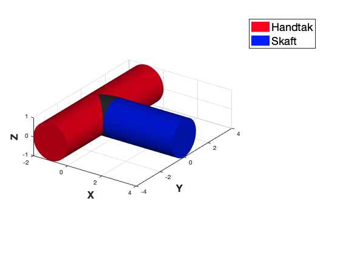
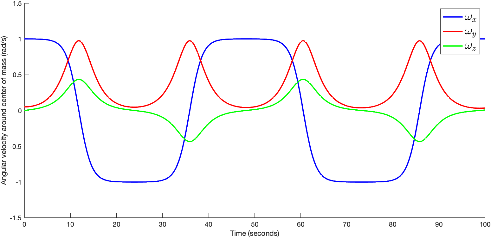
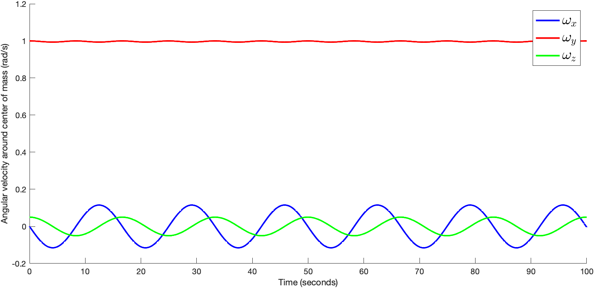
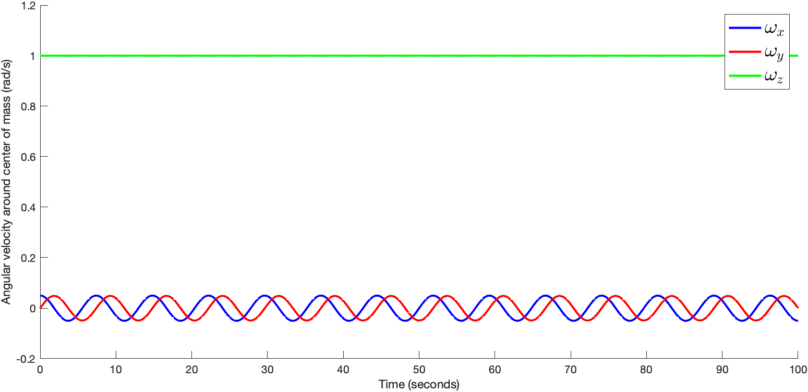
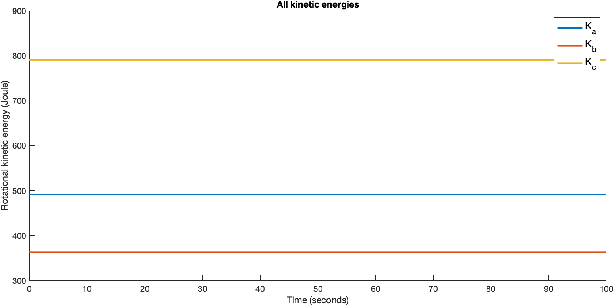

# TDAT3024 - Mathemathics Group Project

# Rotating T-handle

## Angular velocity around center of mass for each axis over 100 seconds

### Initial angular velocity `[1x, 0.05y, 0z]`

### Initial angular velocity `[0x, 1y, 0.05z]`

### Initial angular velocity `[0.05x, 0y, 1z]`

## Total rotational kinetic energy throughout for each case

## **WIP** Animation of T-handle

### Initial angular velocity `[1x, 0.05y, 0z]`

### Initial angular velocity `[0x, 1y, 0.05z]`

### Initial angular velocity `[0.05x, 0y, 1z]`

